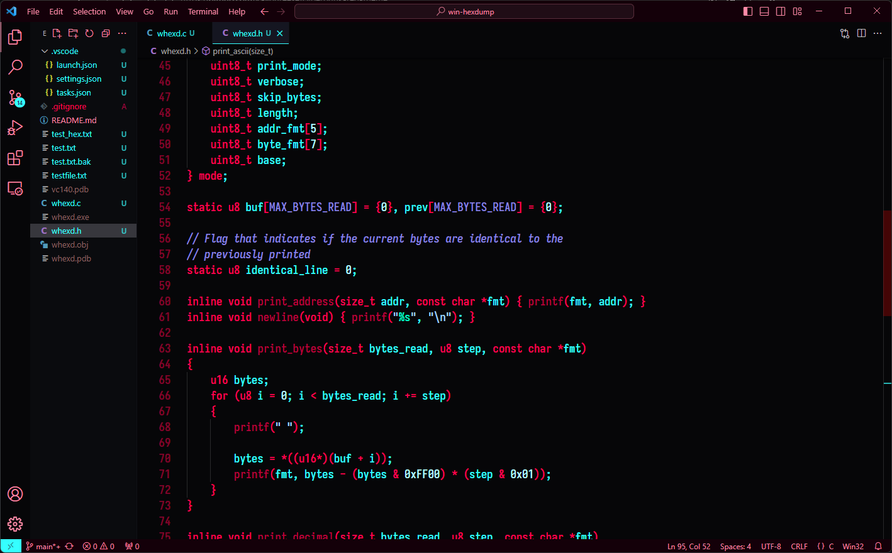

# Cyberpunk Red Theme
This is a dark theme for Visual Studio Code based on Cyberpunk's 2077 red and cyan theme. It is heavily influenced by [this Cyberpunk Theme](https://github.com/prometheux-ar/cyberpunk). 
The goal of this theme is to be simple and minimal, with as few colors as possible.  
Realistically, it is not meant for most people but I always wanted to make a theme that perfectly fits my taste. And so I thought to share it here, for anyone interested.

# Usage
I have yet to publish the theme through the extension shop in VS Code, however you can package it and install it yourself for the time being, as follows:
<ol>
    <li>Clone repository</li>
    <li>CD into "cyberpunk-red-theme"</li>
    <li>Execute <code>vsce package</code> -> A <code>.vsix</code> file will be created</li>
    <li>Execute <code>code --install-extension [the .vsix file created] </code></li>
    <li>Hopefully, the theme installed and you are good to go! Enjoy! :)</li>
</ol>  

Recommended fonts: [Fira Code](https://github.com/tonsky/FiraCode) or [Iosevka](https://github.com/be5invis/Iosevka).

# Project Scope
This is still a Work In Progress.  
It is only intended for the C and C++ languages. I don't plan on supporting other languages.  
There may be support for other file types, as I see fit.

# Current Status
| Language / File type | Status |
| -------------------- | ------ |
| C | Almost there |
| C++ | No progress |
| Markdown | Under way |
| JSON | Complete |

NOTE: Missing languages or file types means that I will either not support them or I have not yet used them since the time I started this theme.

# Contributing
This project is not intended to become large. So I will not be accepting Pull Requests, in order to preserve my vision.  
However, feel free to open issues for any bug you may encounter or for suggesting new colors/features.    
Thank you!
